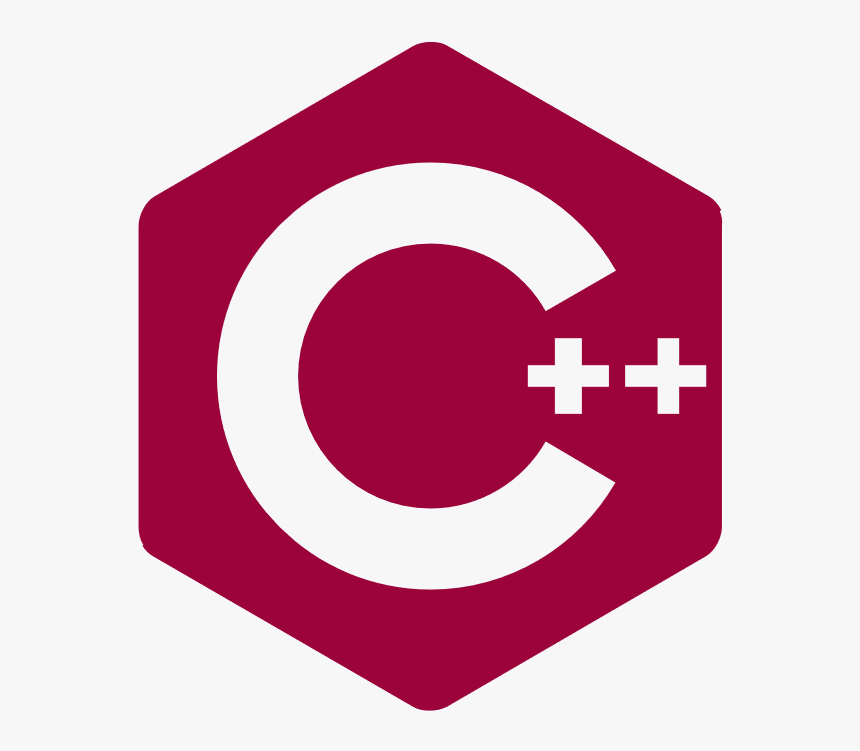

# Моя первая запись в блоге

Опубликовано: 10.12.2024

Добро пожаловать в мой _новый блог_ об изучении С++! Здесь я буду рассказывать о своем учебном пути, пока я создаю новый сайт.

## Чего я добился

1. **Основы С++**: Сначала я изучила основы С++
2. **Работа с Git Git Hub** Настроила свои учетные записи на GitHub. 
3. **Создада свой первый проект** создала новый проект игра "Жизнь" на языке С++

4. **Создание страниц**: Опубликовала свой первый проект на Git Hub

5. **Создание записей в блоге**: Это моя первая запись в блоге! 

## Что дальше

Я продолжаю изучать язык программирования С++
Ссылка на проект 'https://github.com/Karik86/Life/tree/main'